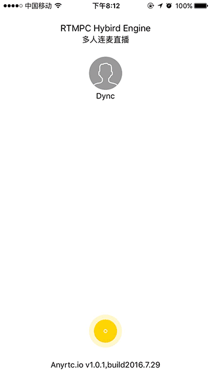
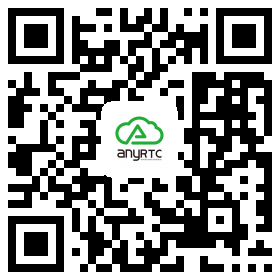

# RTMPCHybridEngine-IOS
基于RTMP和RTC混合引擎的在线视频连麦互动直播。 
iOS 直播（网络自适应码率RTMP publisher）、点播播放器（播放器经过专业优化，可实现秒开RTMP Player）、基于RTMP 和RTC 混合引擎的的视频连麦互动（最多支持四路连麦互动）。
##简介
RTMPCHybridEngine是为移动端应用量身打造的基于RTMP和RTC混合引擎的连麦互动流媒体直播系统。通过集成本SDK，只需几个简单API调用，便可实现一套完整的连线麦互动直播流媒体应用。包含了流媒体应用中：『采集->编码->传输->解码->播放->连麦视频互动』的所有步骤。 
##关于SDK库
由于Github 上限制文件大小，故demo 中的库是基于armv7,armv7s,arm64的，所以调试必须用真机~ 
#优势 
**超低延时** 
**超低内存** 
**无缝连接（原有方案不变的情况，直接嵌入SDK）** 
**文字互动、弹幕消息** 
**人员上下线** 
**多达4人同时在线连麦视频互动** 
## 项目展示

## 扫描二维码下载demo

###演示注意事项
1：演示需要两部以及两部以上的手机，装上该demo. 
2：一部手机创建直播间，另外两部手机在主页，下拉刷新当前直播列表，点击列表进入直播间。 
3：游客端点击链接按钮，进行连麦。 
#SDK包含
RTC 连麦互动 
RTMP 推流器 
RTMP 播放器 

##编译环境
**xcode** 7以上 
替换Demo中的推流跟拉流地址便可~

##支持的系统平台
**iOS** 8.0及以上

##支持的CPU架构
**iOS** armv7 、arm64。  支持bitcode

##支持的流媒体服务端
fms, wowza, evostream, red5, crtmpserver, nginx-rtmp-module, srs及其他标准RTMP协议服务端

##支持的流媒体云服务器
[网宿](http://www.wangsucloud.com/)、[UCloud](https://www.ucloud.cn/)及其他标准RTMP协议云服务器

# 项目特点
**1，商业级开源代码，高效稳定** 
**2，超小内存占有率，移动直播针对性极致优化，代码冗余率极低** 
**3，iOS全平台适配，硬件编解码可保证99%的可用性** 
**4，接口极简，推流：2个   拉流：2个** 
**5，底层库C++核心库代码风格采用：Google code style** 
**6，极简内核，无需再去深扒复杂的FFMpeg代码** 
**7，实用主义，那些什么坑什么优化等概念请搜索相关文章** 
**8，OpenH264软件编码，FFMpeg软件解码，FAAC/FAAD软件编解码，适配不同系统的硬件编解码统统包含** 
**9，支持SRS、Nginx-RTMP等标准RTMP服务；同时支持各大CDN厂商的接入** 

##ipv6
苹果2016年6月新政策规定新上架app必须支持ipv6-only。该库已经适配
##Android版连麦互动Demo
[RTMPCHybridEngine-Android](https://github.com/AnyRTC/RTMPCHybirdEngine-Android)
##Windows版连麦互动Demo
[RTMPCHybridEngine-WIN](https://github.com/AnyRTC/RTMPCHybirdEngine-WIN)

##商用授权
程序发布需商用授权，业务咨询请联系
QQ:984630262  
QQ交流群:580477436 
联系电话:021-65650071 
Email:zhangjianqiang@dync.cc 
##关于直播
本公司有一整套直播解决方案，特别针对移动端。本公司开发者平台[www.anyrtc.io](http://www.anyrtc.io)。除了基于RTMP协议的直播系统外，我公司还有基于WebRTC的时时交互直播系统、P2P呼叫系统、会议系统等。快捷集成SDK，便可让你的应用拥有时时通话功能。欢迎您的来电~
## License

RTMPCHybridEngine is available under the MIT license. See the LICENSE file for more info.
